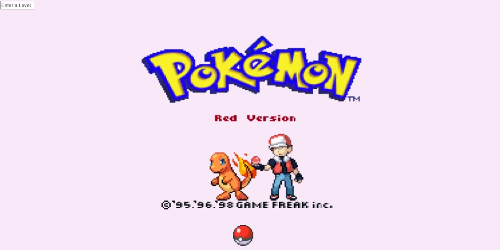

# :mortar_board: Pokemon Game on Directed Weighted Graph Java Implementation

This project is divided into to main components:
- An implementation of a directed weighted graph which is being used to participate in a Pokemon catching game.
- The second and main component of this project is the Pokemon catching game. In this game we developed algorithmic artificial intelligence that scans the graph and catches as much pokemons as it cans
  
### Project structure
The projects structure includes two main packages:
- **API** - The main directed weighted graph classes and sources
- **Game Client** - The main game component contains all the algorithms and objects for playing the game
    - **Util** - Utilities for the whole projects most of them are use for painting and claulating
    
   
- Our main data structure of choice is a **HashMap** that is used to store every node in the graph and also used to 
implement weighted graph main mechanism, the weighted edges via the **EdgeInfo** object. 
  
- The main reasons we chose HashMap is because of the high efficiency for our project.  
For example the efficient `put()`, `get()` and `contains()` are all O(1) and most importantly the `values()` and `keyset()` methods that  
returns a **Collection** view of all the values/keys contained in this map accordingly. The `values()` and `keyset()` are perfect for the implementation  
of our `getV()` methods which are used in almost every algorithm and iteration in this project.  
  
## :computer: Main Classes and Methods  
  
### :chart_with_upwards_trend: DWGraph_DS

This class implements a mathematical directed weighted graph by implements two classes internally
 :one: **NodeData** which implements the basic information and methods each node stores
 :two: **EdgeDB** which stores all the data and methods for all the edges in the graph. This internal class 
 is implemented on top of the received interface's for higher efficiency and complexity of the project.
 Each graph consists of two HashMap data structures. One for the node and the other for the edges.
 Each graph also has an integer that count the edges and the mode count (internal changes count) of the graph

| **Methods**      |    **Details**        |
|-----------------|-----------------------|
| `DWGraph_DS()` | Default constructor     |
| `getNode()` | Returns a node by the nodeKey |
| `getEdge()` | Returns an edge on the graph |
| `addNode` | adds a node to the graph |
| `connect()` | connects between to edges in the graph |
| `getV()` | Returns a collection of the graph edges |
| `getE()` | Returns a collection of the certain nodes connected edges |
| `removeNode()` | Removed a node from the graph |
| `removeEdge()` | Remove an edge between two nodes in the graph |
| `nodeSize()` | Returns the number of the nodes in the graph |
| `edgeSize()` | Returns the number of the edges in the graph |
| `getMC()` | Returns the number of mode counts in the graph, Every change in the internal state of the graph counts as a mode count |
| `equals()` | Compares two graphs and cheks if they are equal |
| `toString()` | Creates a String representing the graph, adds each and every connection |

###### EdgeDB

| **Methods**    |    **Details**             |
|----------------|----------------------------|
| `connectDB()` | connect two nodes one way |
| `hasNi()` | Checks if a selected node has the received neighbor node |

 > :lock: EdgeDB is an internal class to store all the relevant edges to each node

#### NodeData

| **Methods**      |    **Details**        |
|-----------------|-----------------------|
| `NodeData()` | Constructs a new node with the given key |
| `getKey()` | Returns the nodes key |
| `geo_location()` | Returns this nodes geo_location |
| `set_location()` | Sets this nodes geo_location | 
| `getWeight()` | Returns this nodes weight |
| `setWeight()` | Sets this nodes weight |
| `getInfo()` | Returns the nodes String metadata |
| `setInfo()` | Sets the nodes String metadata |
| `getTag()` | Returns the nodes double tag |
| `setTag()` | Sets the nodes double tag |
| `compareTo()` | Compares two nodes by the tag, chooses lowest |

#### EdgeInfo

| **Methods**    |    **Details**             |
|----------------|----------------------------|
| `EdgeInfo()` | The EdgeInfo constructor |
| `setWeight()` | Sets the weight between two nodes in a single direction |
| `connectE()` | Connects an edge between two nodes in a single direction |
| `hasNi()` | Checks if a selected node has the received neighbor node |
| `getNi()` | Returns a Collection representing the neighbors of a node |
| `getW()` | Returns the weight of an edge between two nodes |
| `removeSrc()` | Clears the data structure containing all the nodes connections |
| `getNiSize()` | Returns the neighbor count of a specific node |
| `removeEd()` | Removes and edge between two nodes in a single direction |
 
#### :bar_chart: DWGraph_Algo

Implements all the possible graph algorithms onn a given graph

| **Method**      |    **Details** |
|-----------------|--------------|
| `DWGraph_Algo()` | Default constructor, can also constract from a given graph | 
| `init()`         | Initialize the graph |
| `copy()`        | Creates a deep copy of the graph |
| `getGraph()` | Returns a pointer to the initialized graph |
| `isConnected()` | Checks if the graph is connected |
| `shortestPathDist()` | Returns the length of te shortest path between two node, if non existent returns -1 |
| `shortestPath()` | Returns a List<node_data> of the shortest path between two nodes, if non existent returns null |
| `save()` | Saves a graph to a file via Serialization |
| `load()` | Loads a graph from a file via Deserialization |
| `reset()` | Rests the graph's tag and metadata after running an algorithm |

### :bar_chart: Graphics

 > :lock: The historic start screen, Won't be showcased in the project due being removed in order to make the application Command Line compatible

#### Gframe

Inherits from Gpanel used to set components, draw and paint the graph and pokemons
Also implements mlouse listener

| **Method**      |    **Details** |
|-----------------|--------------|
| `updategame()`         | Updates the game arena. |
| `updateFrame()` |  Called by update game,sets the game. |
| `initMain()` | Creates and sets the main screen. |
| `mouseClicked()` | Implements  MouseListener, notifies game of clicking changes. |
| `mousePressed()` | Implements  MouseListener, notifies game of clicking changes. |
| `getPressed()` | Returns pressed value. |
| `getJText` | Returns a JTextField obj. |
| `setJText()` | Sets JTextField obj. |
| `setLevel` | Sets level's value. |
| `getJTextString` | Returns the JTextField's String |
| `setPressed` | Sets pressed value. |
| `check()` | Checks the user input.  |
| `getRex` | Returns Rex (Re-scale x). |
| `getRey` | Returns Rey (Re-scale y) |
| `setRex` | Sets Rex (Re-scale x) |
| `setRey()` | Sets Rey (Re-scale y) |
| `moved()` | Sets bound of JButton when moved, by Rex and Rey |

##### GPanel

Inherits from Gpanel used to set components, draw and paint the graph and pokemons

| **Method**      |    **Details** |
|-----------------|--------------|
| `update()`         | Updates the game arena. |
| `updateFrame()` |  Called by update game,sets the game. |
| `paint()` | Overrides the default. |
| `mypaint()` | Paints the wanted scene but the state of the game. |
| `mainmenu()` | Paints the main screen (0) background |
| `drawGraph()` | Draws the Graph, calling drawnode() and drawedge(). |
| `drawPokemons` | Draws the pokemons on the graph who is typed 1. |
| `drawCaterpie()` | Draws the pokemons on the graph who is typed -1. |
| `drawAgants` | Draws the Agants on the graph. |
| `drawNode` | Called by drawGraph(), draws the node on the graph |
| `drawEdge` | Called by drawGraph(), draws the edges on the graph |
| `drawBackground()` | Draws the background of scene 1.  |

##### myAction

Our implementation of a key listener

| **Method**      |    **Details** |
|-----------------|--------------|
| `keyPressed()`         | Updates the frame level and pressed values when a key is pressed. |
| `keyReleased()` |  Updates the frame level and pressed values when a key is pressed. |
| `check()` | If statement to check user input. |

##### compAdapt

Our implementation of a component listener

| **Method**      |    **Details** |
|-----------------|--------------|
| `componentResized()`         | Calculates the re-scale factor for both x and y when the frame is being resized. |
| `setFrame()` |  Sets the working frame |

## :mag: Game Mechanisms and Algorithmic Classes

#### Ex2 

The main algorithmic class of the project. This class contains and manages the whole project by relying on the Arena class. First we initialize a game with a specific scenario and than each and every step in the game is planned by the rules and functions in that class.

| **Method**      |    **Details** |
|-----------------|--------------|
| `Ex2()` | Constructors for testing and initializing |
| `run()` |  runs the thread |
| `init()` | initializes all the objects for the beginning of the game |
| `moveAgents()` | The main algorithm behind the whole class, orchestrates al the other moves and ordering by calling other functions |
| `chooseTargets()` | choose the appropriate target for each adn every pokemon |
| `chooseTargetsByProximity()` | chooses the next target by agents proximity to each other |
| `chooseNextNode()` | chooses the next node for each and every agent to target |
| `returnClosestPokemon()` | Returns the closest pokemon to this agent on the graph |
| `checkProximityCase()` | Checks proximity conflict between the graph agent to prevent them to target close to each other |
| `placeAgents()` | placing the agents for the first move of the graph |
| `returnClosestPokemonArr()` | Returns a sorted array of the closest pokemon for an agent |
| `restTargeting()` | resets the targeting on all the pokemons |
| `setAgentsTargetedArea()` | Divides each agent by an are on the graph (not used in this game) |
| `setTimeToSleep()` | Sets the thread sleep time by agent performance |
| `checkAgentProximityConflict()` | Check if the agents have a proximity conflict between them for a defined radius |
| `checkIfEaten()` | Checks if this agents has eaten a pokemon recently (last move) |
| `getGraphMaxDistance()` | returns the maximum possible distance between two nodes on a graph |
| `printMoves()` | Printout the agent moves |
| `getTime()` | Get time to the end of the game for printing |

#### CL_Pokemon 

This class represents a pokemon. Each pokemon is represented with a location an an edge on a graph. The main target is to eat as many pokemon objects as possible in the given game time each pokemon is initialized, updated and created via a json given from the game server. Unlike the agents we can control the pokemons so we need to analyze their behavior appropriately in order to set our targeting algorithms in Ex2 to reach these pokemons as fast and efficient as possible

| **Method**      |    **Details** |
|-----------------|--------------|
| `CL_Pokemon()` | Constructor from Json or values |
| `getEdge()` |  returns this pokemon edge |
| `setEdge()` |  sets this pokemon edge |
| `getLocation()` |  returns this pokemon geo locations |
| `getType()` |  returns this pokemon type (positive for ascending or negative otherwise) |
| `getValue()` |  returns this pokemon value, the more the better |
| `targetPokemon()` |  targets this pokemon for the next move |
| `unTargetPokemon()` |  un target this pokemon for the next move |
| `isTargeted()` |  checks if a pokemon is targeted |

#### CL_Agents

This class represents a pokemon. Each pokemon is represented with a location an an edge on a graph. The main target is to eat as many pokemon objects as possible in the given game time each pokemon is initialized, updated and created via a json given from the game server. Unlike the agents we can control the pokemons so we need to analyze their behavior appropriately in order to set our targeting algorithms in Ex2 to reach these pokemons as fast and efficient as possible

| **Method**      |    **Details** |
|-----------------|--------------|
| `CL_Agent()` | Constructor from Json or values |
| `update()` | updates this current agent from json |
| `getSrcNode()` | returns this agents src node |
| `toJson()` | returns Json string of this agent |
| `setNextNode()` | sets this agents next node |
| `getNextNode()` | returns this agents next node |
| `setCurrentNode()` | sets this agents current node |
| `isMoving()` | Checks if this agent is moving |
| `toString()` | converts to string for printing and testing |
| `getID()` | gets this agents ID |
| `getLocation()` |  returns this agents geo locations |
| `getValue()` |  returns this agent value, the more the better |
| `getSpeed()` |  returns this agents speed |
| `getCurrentTarget()` |  returns this agent current target |
| `setCurrentTarget()` |  sets this agent current target |
| `calculateSleepTime()` |  calculates sleep time according to agent |
| `getCurrentEdge()` |  returns this agent current edge |
| `getSleepTime()` |  returns this agent current sleep time for thread sleep |
| `getCurrentTarget()` |  returns this agent current target |
| `setFormerTarget()` |  sets this agents former target |
| `checkFormerTarget()` |  checks this agents former target |
| `setTargetedArea()` |  sets this agents targeted area |
| `getTargetedArea()` |  returns this agents targeted area |
| `getTargetedArea()` |  returns this agents targeted area |
| `setTargetedArea()` |  sets this agents targeted area |
| `setLocation()` |  sets this agents geo location |

#### Arena 

This class represents a multi agent arena it is the main parsing and updating component for all the game information during playtime. Ech and every stage is parsed by methods here by receiving different Json objects from the game server. The update occurs before every target choosing in the game.

| **Method**      |    **Details** |
|-----------------|--------------|
| `Arena()` | Constructor from game component |
| `updateArena()` |  updates all the arena components (pokemons, agents ETC) |
| `setPokemons()` |  sets this arena's pokemons |
| `setAgents()` |  sets this arena's agents |
| `setGraph()` |  sets this arena's graph |
| `getPokemons()` |  returns this arena's pokemons |
| `getGraph()` |  returns this arena's graph |
| `parseGraph()` |  parses a graph from json string |
| `getAgents()` |  returns this arena's agents |
| `initAgentsFromJson()` |  initializes (creates) the arena's agents from Json |
| `initPokemonsFromJson()` |  initializes (creates) the arena's pokemons from Json |
| `updateAgentsFromJson()` |  updates the arena's agents from Json |
| `updateEdge()` |  updates a given pokemon edge from the graph |
| `updatePokemonEdges()` |  updates all given pokemon edge from the graph |
| `updateAgentEdges()` |  updates all given agents edge from the graph |
| `isOnEdge()` |  checks if a pokemon is on a certain edge |
| `GraphRange()` | returns the two dimensional range of the graph |
| `w2f()` |  Ranged frame for the graph drawings |

## :mag: Tests

In this project we invested extensively in testing our implementation. 
We created a test for each and every complex and simple method in this project.

The tests rely on two main mechanisms:
- a `graph_creator()` method we build that creates a graph with the set amount 
of nodes and edges while randomizing their connections
- a complex and unique graph build in advanced that we researched it behavior and take advantage 
of that in order to test complex algorithms like BFS and Dijkstra's. 
Implemented in `mainTestGraph()` and `mainTestGraphAlg()` accordingly

## Game Results
| **Stage** | **Moves** | **Grade** |
|-----------|-----------|-----------|
| 1 |  |  |
| 2 | 548 | 249 |
| 3 | 1166 | 774 |
| 4 | 578 | 216 |
| 5 | 1094 | 531 |
| 6 | 580 | 79 |
| 7 | 1116 | 337 |
| 8 | 546 | 80 |
| 9 | 1092 | 364 |
| 10 | 546 | 112 |
| 11 | 1098 | 1383 |
| 12 | 546 | 52 |
| 13 | 1092 | 201 |
| 14 | 528 | 139 |
| 15 | 1084 | 283 |
| 16 | 542 | 167 |
| 17 | 1084 | 846 |
| 18 | 544 | 40 |
| 19 | 1086 | 234 |
| 20 | 544 | 139 |
| 21 | 1086 | 244|
| 22 | 542 | 131 |
| 23 | 1084 | 420 |

## :memo: External articles and links used in the making of this project  
  
### HashMap intel and efficiency:
- https://javatutorial.net/java-iterate-hashmap-example
- https://stackoverflow.com/questions/1757363/java-hashmap-performance-optimization-alternative
- https://dzone.com/articles/how-to-use-java-hashmap-effectively
- https://dzone.com/articles/hashmap-performance
- https://stackoverflow.com/questions/55263115/detail-the-big-o-of-hashmap-put-method-by-real-code-in-java-8
  
### HashSet intel and efficiency:
- https://stackoverflow.com/questions/3267572/fastest-data-structure-for-contains-in-java
- https://www.baeldung.com/java-hashset-arraylist-contains-performance
  
### Dijkstra's Algorithm
- https://www.coursera.org/lecture/advanced-data-structures/core-dijkstras-algorithm-2ctyF
- https://en.wikipedia.org/wiki/Shortest_path_problem

### PriorityQueue and Comparable Usage
- https://www.youtube.com/watch?v=c4ES6jGxqEw

### Gson
- https://github.com/google/gson
- https://futurestud.io/tutorials/gson-getting-started-with-java-json-serialization-deserialization
- https://www.youtube.com/watch?v=HSuVtkdej8Q

### JFrame
- https://www.youtube.com/watch?v=4T3WJEH7zrc
- https://www.youtube.com/watch?v=Kmgo00avvEw
